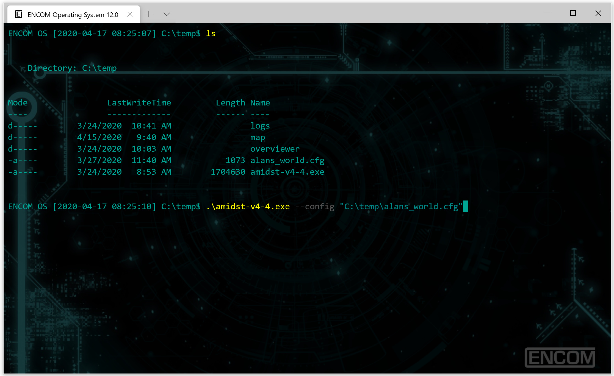

# Windows Terminal - ENCOM OS
Windows Terminal Powershell Theme - ENCOM OS 12.0 from Tron: Legacy



This is just powershell themed to look less boring!

## Setup

### Step 1

Download the repo and place the content of the ".Terminal" folder in your user profile directory.

### Step 2

Setup new entry in windows terminal.

In your windows terminal settings.json create a new profile list item

```
{
  "guid": "{8c6538a6-a82d-4dd6-b46f-6f249d80a7ea}",
  "name": "ENCOM Operating System 12.0",
  "commandline": "powershell.exe -NoLogo -NoExit -File %userprofile%\\.Terminal\\encomos\\profile.ps1",
  "hidden": false,
  "startingDirectory": "C:\\src",
  "colorScheme": "ENCOM",
  "icon": "%userprofile%\\.Terminal\\encomos\\icon.png",
  "backgroundImage": "%userprofile%\\.Terminal\\encomos\\background_alt_2.png",
  "backgroundImageOpacity": 0.25,
  "backgroundImageStretchMode": "uniformToFill",
  "cursorShape": "filledBox",
  "cursorColor": "#00a595"
}
```

### Step 3

Add color theme to settings.json.

Iin the schemes section add the following

```
{
  "name": "ENCOM",
  "black": "#000000",
  "red": "#9f0000",
  "green": "#008b00",
  "yellow": "#ffd000",
  "blue": "#0081ff",
  "purple": "#bc00ca",
  "cyan": "#008b8b",
  "white": "#bbbbbb",
  "brightBlack": "#555555",
  "brightRed": "#ff0000",
  "brightGreen": "#00ee00",
  "brightYellow": "#ffff00",
  "brightBlue": "#0000ff",
  "brightPurple": "#ff00ff",
  "brightCyan": "#00cdcd",
  "brightWhite": "#ffffff",
  "background": "#000000",
  "foreground": "#00a595"
}
```

### Step 4 

Save settings.json and reload terminal. You should now have a custom themed powershell that looks like the screenshot above!
